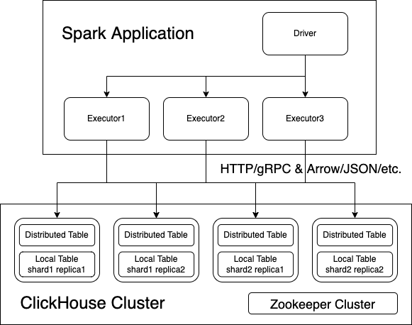

---
hide:
  - navigation

license: |
  Licensed under the Apache License, Version 2.0 (the "License");
  you may not use this file except in compliance with the License.
  You may obtain a copy of the License at
      https://www.apache.org/licenses/LICENSE-2.0
  Unless required by applicable law or agreed to in writing, software
  distributed under the License is distributed on an "AS IS" BASIS,
  
  WITHOUT WARRANTIES OR CONDITIONS OF ANY KIND, either express or implied.
  
  See the License for the specific language governing permissions and
  limitations under the License.
---

Overview
===

Spark ClickHouse Connector is a high performance connector build on top of Spark DataSource V2.

<figure markdown>
  
</figure>

## Requirements

1. Basic knowledge of [Apache Spark](https://spark.apache.org/docs/latest/) and [ClickHouse](https://clickhouse.com/docs/en/).
2. An available ClickHouse single node or cluster.
3. An available Spark cluster, and Spark version should be 3.2 or 3.3, because we need the interfaces of Spark DataSource V2
   added in 3.2.0 or 3.3.0.
4. Make sure your network policy satisfies the following requirements, both driver and executor of Spark need to access 
   ClickHouse HTTP/gRPC port. If you are using it to access ClickHouse cluster, ensure the connectivity between driver and
   executor of Spark and each node of ClickHouse cluster.

## Notes

1. Integration tests based on Java 8&11, Scala 2.12&2.13, Spark 3.2.2&3.3.0 and ClickHouse v22.3.3.44-lts, with both single
   ClickHouse instance and ClickHouse cluster.
