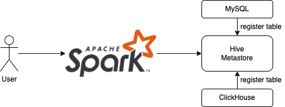
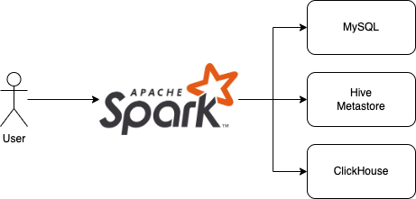

Catalog Management
===

One important end user facing feature of DataSource V2 is supporting of multi-catalogs.

In the early stage of Spark, it does have catalog concept, usually, user use Hive Metastore or Glue to manage table
metadata, hence user must register external DataSource tables in centralized metastore before using it.

<figure markdown>
  
</figure>

In the centralized metastore model, a table is identified by `<database>.<table>`.

Things changed in DataSource V2, starting from v3.0.0, Spark introduced catalog concept, then a table is identified by
`<catalog>.<database>.<table>`.

<figure markdown>
  
</figure>

The default catalog has a fixed name `spark_catalog`.
