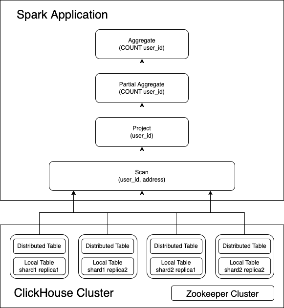
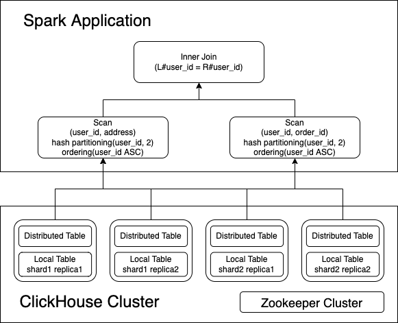

How reading of the connector works?
===

## Push Down

The connector implements most push down interfaces defined by DataSource V2, such as `SupportsPushDownLimit`,
`SupportsPushDownFilters`, `SupportsPushDownAggregates`, `SupportsPushDownRequiredColumns`.

The below example shows how `SupportsPushDownAggregates` and `SupportsPushDownRequiredColumns` work. 

<figure markdown>
  
  <figcaption>No Push Down</figcaption>
</figure>

<figure markdown>
  
  <figcaption>Aggregate Push Down</figcaption>
</figure>

## Bucket Join

Sort merge join is a general solution for two large table inner join, it requires two table shuffle by join key first,
then do local sort by join key in each data partition, finally do stream-stream like look up to get the final result.

<figure markdown>
  
  <figcaption>Sort Merge Join</figcaption>
</figure>

<figure markdown>
  
  <figcaption>Bucket Join</figcaption>
</figure>
